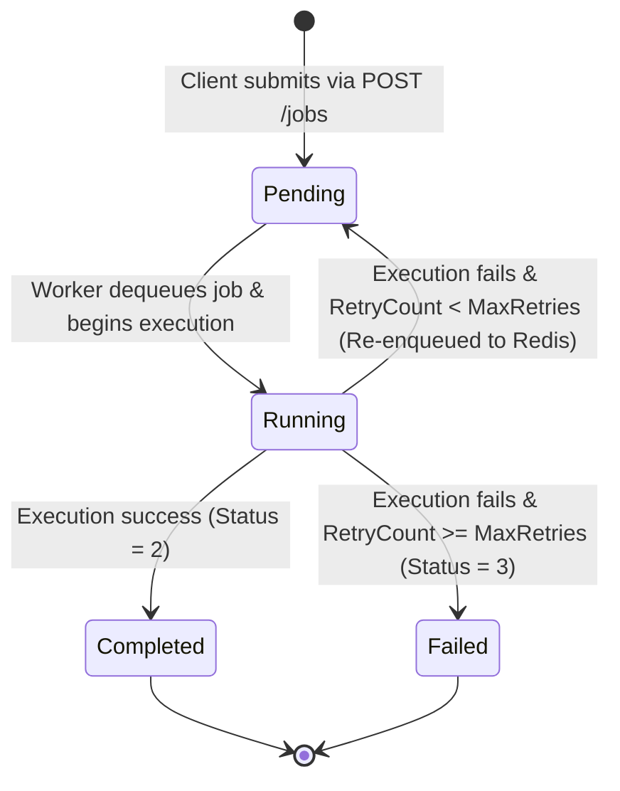
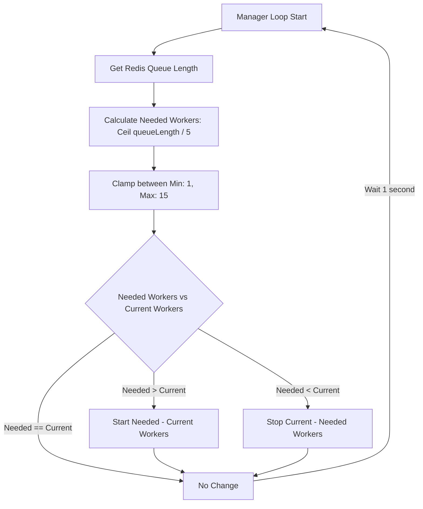

# TaskForge

TaskForge is a Go-based asynchronous job processing system that uses Redis-backed queues, autoscaling worker pools, SQLite persistence, and pluggable LLM execution. It enables long-running AI tasks to execute in the background while HTTP APIs remain responsive.

By leveraging a decoupled queue-based architecture, TaskForge ensures that clients receive instantaneous responses upon submitting jobs, while background workers process task execution, perform LLM calls, handle retries, update statuses, and collect telemetry counters asynchronously.

---

## Table of Contents
1. [Why TaskForge?](#why-taskforge)
2. [System Architecture](#system-architecture)
3. [Architecture & Component Interaction Diagram](#architecture--component-interaction-diagram)
4. [Core Components Analysis](#core-components-analysis)
5. [Job Lifecycle & Flowcharts](#job-lifecycle--flowcharts)
6. [Dynamic Worker Autoscaling](#dynamic-worker-autoscaling)
7. [Step-by-Step Execution Journey](#step-by-step-execution-journey)
8. [Directory & Package Layout](#directory--package-layout)
9. [API Specifications](#api-specifications)
10. [Getting Started & Installation](#getting-started--installation)
11. [Technical Design Notes & Caveats](#technical-design-notes--caveats)

---

## Why TaskForge?

In modern web applications, performing slow, blocking operations—such as calling external LLM APIs (e.g., OpenRouter, OpenAI) or waiting for complex computations—inside the HTTP request-response cycle leads to multiple engineering issues:
- **Client Blocking & Timeouts**: Clients must keep connections open for several seconds, leading to browser timeouts and poor user experience.
- **Resource Exhaustion**: HTTP server threads/goroutines are held open waiting on external systems, quickly exhausting resources under load.
- **Lack of Fault Tolerance**: If an external API call fails (due to rate limits, network glitches, etc.), the request fails permanently without a clean retry mechanism.
- **Inability to Scale**: Background workloads cannot be scaled independently from front-end HTTP request handlers.

**TaskForge solves these problems by:**
1. **Decoupling Submissions**: Incoming requests are immediately stored as `Pending` and their IDs pushed onto a Redis queue. The client receives a `200 OK` response with a job ID in milliseconds.
2. **Robust State Tracking**: State changes are mirrored in a persistent SQLite database for auditability and history, and cached in a fast in-memory store for worker speed.
3. **Automatic Retries**: If execution fails (e.g., LLM API failure), jobs are automatically rescheduled up to a configurable threshold (`MaxRetries`) before marked as permanently `Failed`.
4. **Dynamic Autoscaling**: A central manager continuously monitors queue depth and dynamically adjusts the active background worker count to handle sudden spikes in traffic without manual intervention.

---

## Features

- Redis-backed asynchronous job queue
- Autoscaling worker pool
- Graceful worker shutdown using context.Context
- Retry mechanism with configurable retry limits
- SQLite persistence
- Thread-safe in-memory cache
- OpenRouter LLM integration
- Pluggable LLM interface
- Metrics endpoint
- Pure Go implementation

## System Architecture

TaskForge implements a classic **Producer-Consumer pattern** backed by key-value queues, local caching, and relational SQL storage:

```
                  ┌──────────────────────┐
                  │   Client / Caller    │
                  └──────────┬───────────┘
                             │
            Submit Job       │   Get Job Details / Metrics
          (POST /jobs)       │   (GET /jobs/:id)
                             ▼
                  ┌──────────────────────┐
                  │    HTTP API Server   │
                  │   (internal/api)     │
                  └────┬───────────┬─────┘
                       │           │
          Save Job     │           │   Enqueue Job ID
                       ▼           ▼
        ┌──────────────┴──────┐ ┌──┴──────────────────┐
        │ Persistent Database │ │     Redis Queue     │◄────────┐
        │ (internal/database) │ │   (internal/redis)  │         │
        └─────────────────────┘ └──────────┬──────────┘         │
                                           │                    │ Enqueue
                                           │ BLPop (Job ID)     │ Retry
                                           ▼                    │
                                ┌─────────────────────┐         │
                                │   Worker Loop       ├─────────┘
                                │  (internal/worker)  │
                                └──────────┬──────────┘
                                           │
                                           │ Execute
                                           ▼
                                ┌─────────────────────┐
                                │  Execution Engine   │
                                │ (internal/executor) │
                                └──────────┬──────────┘
                                           │
                                           │ Generate (if LLM type)
                                           ▼
                                ┌─────────────────────┐
                                │   LLM Client        │
                                │   (internal/llm)    │
                                └──────────┬──────────┘
                                           │
                                           │ HTTP Request
                                           ▼
                                ┌─────────────────────┐
                                │  OpenRouter AI API  │
                                └─────────────────────┘
```

---
## Core Components Analysis

### 1. API Server (`internal/api`)
- **Constructor**: Accepts Redis queue, in-memory Store, SQLite Database, and Metrics managers.
- **Routing**: Uses Go standard library routing with method matching. Exposes `POST /jobs`, `GET /jobs`, `GET /jobs/`, and `GET /metrics`.
- **Ingestion**: Sanitizes incoming payloads, increments a global request sequence counter (`count`), builds a new `Job` object starting in `Pending` state, saves it to SQLite, registers it in the cache, increments pending metrics, and enqueues the Job ID to Redis.

### 2. Queue Manager (`internal/manager`)
- **Worker Pool Controller**: Runs a perpetual ticker loop every 1 second.
- **Scaling Algorithm**: Checks queue length from Redis and determines optimal workers: `Ceil(queueLength / 5)`. 
- **Pool Management**: Spawns or halts worker goroutines dynamically, ensuring that there is always **at least 1 active worker** (min: 1, max: 15). Worker shutdown is gracefully achieved via standard library `context.CancelFunc`.

### 3. Background Workers (`internal/worker`)
- **Loop**: Goroutines running a continuous queue consumption loop.
- **Task Dequeue**: Uses `BLPop` (blocking list left pop) on Redis for the key `"jobs"` with a 1-second timeout.
- **Job Orchestration**: Transitions job state to `Running`, invokes the Executor, and registers status transitions (`metrics.Update`, local `store` cache, and SQL `database.UpdateJob`).
- **Error Handling**: Increments `RetryCount` upon execution failures. If `RetryCount < MaxRetries`, it resets status to `Pending` and re-enqueues the Job ID into Redis. Otherwise, it marks the job as permanently `Failed` and saves the error message.

### 4. Task Executor (`internal/executor`)
- **Decoupled Execution Logic**: Separates queue management from actual compute execution.
- **Execution Strategy**: Sleeps for 2 seconds to simulate processing delay. If `Type == "llm"`, it forwards the job context to the LLM client. If `Type == "fail"`, it manually forces an error. Otherwise, it defaults to returning `"success"`.

### 5. LLM Client (`internal/llm`)
- **Interface Driven**: Exposes a `Client` interface to easily support pluggable models.
- **OpenRouter Client**: Implements `llm.Client` via `OpenRouterClient`. Connects to OpenRouter's HTTP chat completion API using a configured token. It builds the JSON payload, sets a strict token limit of 100, sets appropriate Bearer headers, and fires requests under a 30-second context timeout.

### 6. Storage Components
- **Redis Queue (`internal/redis`)**: Runs `RPush` and `BLPop` on the key `"jobs"`. Serves as the transient FIFO messaging channel.
- **In-Memory Store (`internal/store`)**: A thread-safe, mutex-protected (`sync.RWMutex`) map caching active job records for rapid reads by workers.
- **SQLite Database (`internal/database`)**: Built on top of `modernc.org/sqlite` (pure Go SQLite driver). Establishes table schemas and handles durable writes for job archival.

---

## Job Lifecycle & Flowcharts

A job submitted to TaskForge traverses multiple state transitions. Below is the state machine diagram:



### State Integer Mapping
For database and internal logic, states are mapped to integers inside the `internal/job` package:
- `0`: `Pending`
- `1`: `Running`
- `2`: `Completed`
- `3`: `Failed`

---

## Dynamic Worker Autoscaling

The Manager operates as an active feedback loop monitoring queue depth and dynamically scaling workers up or down:



---

## Step-by-Step Execution Journey

1. **Ingestion**: A client issues a `POST /jobs` HTTP request to the API server at port `8080`.
2. **Initialization**: The API Server decodes the JSON request, generates a unique ID (e.g., `job-1`), writes a new `Job` row into `taskforge.db`, caches the job in the in-memory `store`, and issues an `RPush` to the `"jobs"` key on Redis.
3. **Immediate Acknowledgement**: The API Server instantly returns `{"id":"job-1","status":0,"result":""}` back to the client.
4. **Queue Check & Dispatch**:
   - The background worker pool is scaled by the Manager.
   - An idle worker running a blocking pop (`BLPop`) receives the job ID `"job-1"`.
5. **State Update to Running**: The worker changes the job status to `1 (Running)`, updates the in-memory cache, writes the update to `taskforge.db`, and updates the global metrics dashboard counters.
6. **Task Execution**:
   - The worker passes the job details to the Executor.
   - The Executor executes the task. If it is of type `"llm"`, it initiates an outbound HTTP call to the OpenRouter API endpoint.
7. **Resolution or Retry**:
   - **Success**: The worker receives the resulting string, sets status to `2 (Completed)`, updates metrics, stores the result in SQLite, and updates the in-memory cache.
   - **Failure**: The worker catches the error, increments the job's `RetryCount`.
     - *If `RetryCount < 3`*: Status resets to `0 (Pending)` and the job ID is pushed back to Redis queue.
     - *If `RetryCount == 3`*: Status is set to `3 (Failed)`, error text is saved, and both database and metrics are updated.

---

## Directory & Package Layout

```
autoworkers/
├── cmd/
│   └── server/
│       └── main.go           # Application entry point, instantiates all components
├── internal/
│   ├── api/
│   │   ├── server.go         # HTTP router and server start logic
│   │   └── handler.go        # HTTP handlers (Submit, Get, List, Metrics)
│   ├── database/
│   │   └── database.go       # SQLite persistence setup, queries, and updates
│   ├── executor/
│   │   └── executor.go       # Orchestrates execution logic (delays, LLM calls, fail simulation)
│   ├── job/
│   │   └── job.go            # Job data models, structures, and state constants
│   ├── llm/
│   │   ├── client.go         # LLM interface definition
│   │   └── openrouter.go     # OpenRouter client API implementation
│   ├── manager/
│   │   └── manager.go        # Autoscaling manager loop controlling worker count
│   ├── metrics/
│   │   └── metrices.go       # Numerical tracking structure for system telemetry
│   ├── queue/
│   │   └── queue.go          # Legacy/Alternative channel-based queue (not active in server)
│   ├── redis/
│   │   └── redis.go          # Redis queue wrappers for Enqueue, Dequeue, LLen
│   ├── scheduler/
│   │   └── scheduler.go      # Legacy/Mock scheduler routine (not active in server)
│   ├── store/
│   │   └── store.go          # Mutex-protected in-memory job state cache
│   └── worker/
│       └── worker.go         # Worker consumption loop, error handling, and retries
├── .env                      # Contains environment configuration (API Key)
├── go.mod                    # Dependencies and Go version specs
├── go.sum                    # Checksums for packages
└── taskforge.db              # SQLite database storage (generated on start)
```

---

## API Specifications

### 1. Submit Job
Submit a new async job.

- **URL**: `POST /jobs`
- **Body Schema**:
```json
{
  "type": "llm",
  "payload": "your optional payload here",
  "model": "openai/gpt-4o-mini",
  "prompt": "Write a short poem about concurrent Go routines."
}
```
*Note*: Other available types are `"fail"` (simulates failure) and default (resolves to success after a 2-second sleep).

- **Response Schema**:
```json
{
  "id": "job-1",
  "status": 0,
  "result": ""
}
```

### 2. Fetch Job Details
Check details, status, and result of a specific job.

- **URL**: `GET /jobs/{id}` (e.g. `/jobs/job-1`)
- **Response Schema**:
```json
{
  "ID": "job-1",
  "Type": "llm",
  "Payload": "your optional payload here",
  "Status": 2,
  "Result": "In the garden of Go, goroutines bloom,\nWeaving through memory, lifting the gloom...",
  "Error": "",
  "Created_time": 0,
  "Started_time": 0,
  "Finished_time": 0,
  "RetryCount": 0,
  "MaxRetries": 3,
  "Model": "openai/gpt-4o-mini",
  "Prompt": "Write a short poem about concurrent Go routines."
}
```

### 3. List All Jobs
List details of all historical and active jobs.

- **URL**: `GET /jobs`
- **Response Schema**:
```json
[
  {
    "ID": "job-1",
    "Type": "llm",
    "Payload": "",
    "Status": 2,
    "Result": "Success output...",
    "Error": "",
    "Created_time": 0,
    "Started_time": 0,
    "Finished_time": 0,
    "RetryCount": 0,
    "MaxRetries": 3,
    "Model": "openai/gpt-4o-mini",
    "Prompt": "Write a short poem..."
  }
]
```

### 4. Fetch System Metrics
Query telemetry counters tracking active system load.

- **URL**: `GET /metrics`
- **Response Schema**:
```json
{
  "pending": 0,
  "running": 0,
  "completed": 1,
  "failed": 0
}
```

---

## Getting Started & Installation

### Prerequisites
1. **Go installed**: Go version `1.22+` (project module declares Go `1.26.3`).
2. **Redis**: Running locally on port `6379`.
```bash
# Example starting redis via Docker
docker run --name taskforge-redis -p 6379:6379 -d redis
```

### Setup Steps
1. Navigate to the code workspace:
```bash
cd autoworkers
```

2. Create a `.env` file containing your OpenRouter token:
```ini
OPENROUTER_API_KEY=sk-or-v1-YOUR_ACTUAL_KEY_HERE
```

3. Launch the Server:
```bash
go run ./cmd/server
```

The system boots, constructs all stores, spins up the initial background worker, initializes SQLite database schemas in `./taskforge.db`, and opens an HTTP listener on port `8080`.

---

## Technical Design Notes & Caveats

During our technical codebase analysis, we noted a few key behavioral items to keep in mind:

- **Metrics Thread Safety**: The `Metrics` struct inside `internal/metrics/metrices.go` does not employ locks. The API handler increments `a.apimetrices.Pending++` directly without mutex protection, while worker threads call `m.metrics.Update(...)` concurrently. Under high concurrent workloads, this can lead to race conditions.
- **In-Memory Store vs Database consistency**: The `store.Store` maps jobs in memory, but `GetJob` retrieves records by querying the SQLite database file directly. The in-memory cache acts as an active status cache for worker processing, but SQLite acts as the primary source of truth for read API queries.
- **Future Work**: The packages `internal/queue` (in-memory channel queue) and `internal/scheduler` (ticks timestamp loop) are fully functional but are currently unused, bypassed in favor of the active Redis queue orchestration.
- **Autoscaling Minimums**: The scaling logic always scales down to `1` rather than `0` workers when the queue is dry. This guarantees immediate pickup of jobs even under cold starts, though it occupies a background thread memory structure indefinitely.

## Tech Stack

- Go
- Redis
- SQLite
- OpenRouter API
- HTTP REST
- Context
- Goroutines
- Mutexes