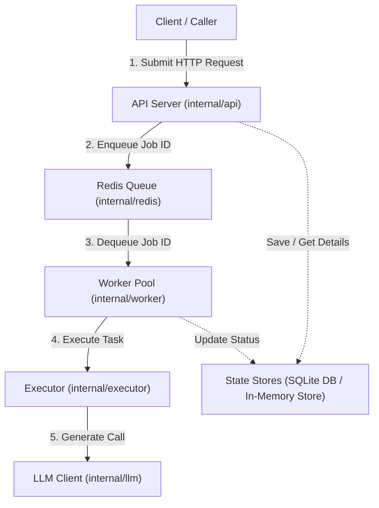
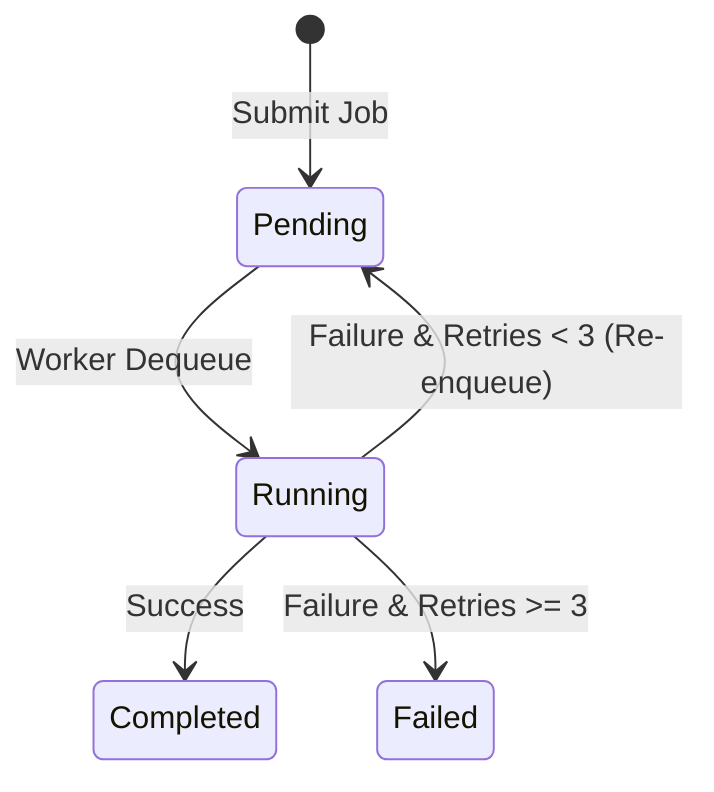

# Auto-Scaling Workers

Auto-Scaling Workers is a Go-based asynchronous job processing engine that uses Redis-backed queues, autoscaling worker pools, SQLite persistence, and pluggable LLM execution. It enables long-running tasks to execute in the background while HTTP APIs remain responsive.

---

## System Architecture & Pipeline

### 1. Component Connections Flowchart
Shows what component connects to what in the execution pipeline:



### 2. Job Lifecycle State Machine
Shows how a job transitions between states (Pending, Running, Completed, Failed):



### Core Architecture Roles
1. **API Server**: Ingests jobs via `POST /jobs` and returns an immediate response with a job ID in milliseconds.
2. **Redis Queue**: Acts as the message broker holding pending job IDs.
3. **Autoscaling Manager**: Monitors queue depth and dynamically scales workers: `Ceil(QueueLength / 5)` (Min: 1, Max: 15).
4. **Workers**: Dequeue job IDs via blocking pop, fetch metadata from in-memory cache, trigger execution (like OpenRouter API calls), and persist states in SQLite (`workers.db`).

---

## Getting Started

### 1. Prerequisites
- **Go**: Version `1.22+`
- **Redis**: Running locally on port `6379`
  ```bash
  docker run --name workers-redis -p 6379:6379 -d redis
  ```

### 2. Run Go Backend
Navigate to the `autoworkers` directory, configure `.env`, and start the server:
```bash
cd autoworkers
echo "OPENROUTER_API_KEY=sk-or-v1-YOUR_KEY" > .env
go run ./cmd/server
```
The server opens on `http://localhost:8080`.

### 3. Run Frontend Dashboard
In a separate terminal, start the Vite client dashboard:
```bash
cd frontend
npm install
npm run dev
```
Open [http://localhost:3000](http://localhost:3000) in your browser. All API requests are proxied automatically to port `8080`.

---

## Testing & Demonstration (CLI Commands)

Use these commands in your terminal to test various features of the engine:

### 1. Concurrent Load Test (Scales Worker Pool)
Submit **20 concurrent jobs** in the background to watch the manager scale up workers in real-time (from 1 worker up to 4+ workers):
```bash
for i in {1..20}; do
  curl -s -X POST http://localhost:8080/jobs \
    -H "Content-Type: application/json" \
    -d "{\"type\": \"default\", \"payload\": \"Job number $i\"}" &
done
```

### 2. Submit LLM Completion Task
```bash
curl -X POST http://localhost:8080/jobs \
  -H "Content-Type: application/json" \
  -d '{"type": "llm", "model": "openai/gpt-4o-mini", "prompt": "Say hello from auto-scaling workers"}'
```

### 3. Submit Failing Task (Triggers 3x Retries)
Submit a job that fails. Background workers will try to run it, increment the retry count, and re-enqueue it until it hits `MaxRetries (3)` before marking it permanently failed:
```bash
curl -X POST http://localhost:8080/jobs \
  -H "Content-Type: application/json" \
  -d '{"type": "fail"}'
```

### 4. Fetch Real-time Telemetry Metrics
```bash
curl http://localhost:8080/metrics
```

### 5. Check Specific Job Status
```bash
# Get details of job-1
curl http://localhost:8080/jobs/job-1
```

---

## API Specifications

| Method | Endpoint | Payload | Description |
|---|---|---|---|
| `POST` | `/jobs` | `{"type": "llm", "model": "...", "prompt": "..."}` | Submit new async job. |
| `GET` | `/jobs` | *None* | List all historical jobs. |
| `GET` | `/jobs/{id}` | *None* | Retrieve status/result of a job. |
| `GET` | `/metrics` | *None* | Get pending/running/completed counts. |